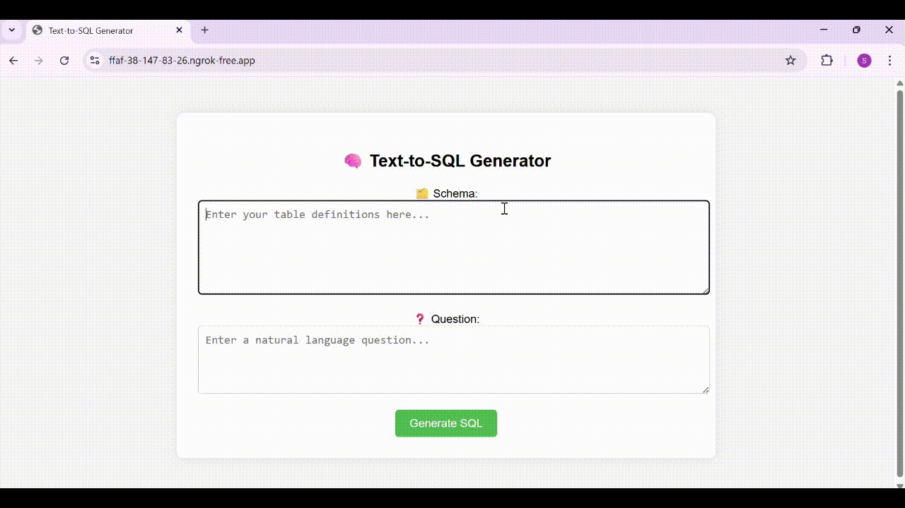

# Text-to-SQL Generator (TinyLLaMA + LoRA + Flask)

This project is a Flask-based web application that converts natural language questions into SQL queries using a **LoRA-fine-tuned TinyLLaMA model**. It utilizes the [Synthetic-Text-To-SQL](https://huggingface.co/datasets/gretelai/synthetic_text_to_sql) dataset for finetuning and is designed to run locally or via a public URL using `ngrok`.

---
<p align="center">
  
</p>
---

## Features

- Converts natural language questions to executable SQL queries
- Fine-tuned with LoRA (Low-Rank Adaptation) for efficient adaptation
- Uses [TinyLLaMA](https://huggingface.co/TinyLlama/TinyLlama-1.1B-intermediate-step-1195k-token-2.5T) for lightweight inference
- Easy deployment with Flask + `pyngrok`
- Clean, responsive HTML UI

---

## Getting Started

### 1. Clone the Repository

```bash
git clone https://github.com/SwathiR1999/Text2Sql.git
cd Text2Sql
```

### 2. Install requirements

```bash
pip install -r requirements.txt
```
### 3. Configure `pyngrok`

Visit [ngrok](https://ngrok.com/) to get your auth token.

```bash
from pyngrok import ngrok
ngrok.set_auth_token("YOUR_NGROK_AUTH_TOKEN")
```

### 3. Run the app

```bash
python app.py
```
You will see

```bash
* ngrok tunnel: <...link...>
```

Open the link in your browser to access the web app.
